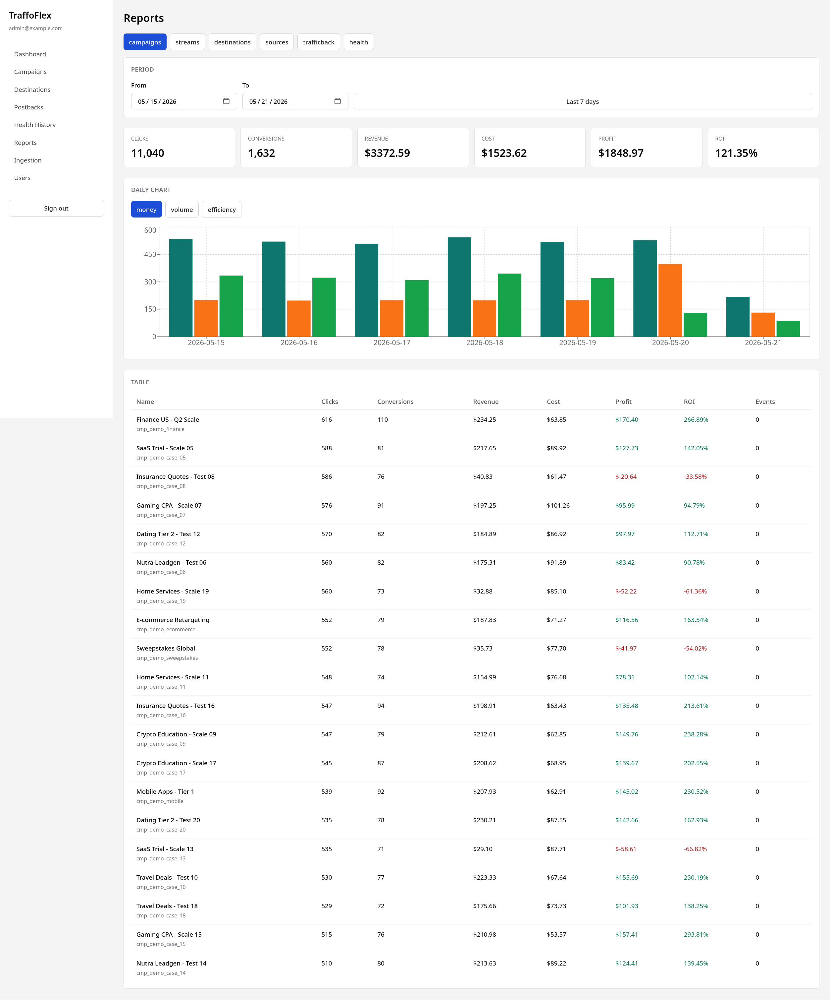

# TraffoFlex

**TraffoFlex** is an open-source, self-hosted MVP for traffic routing, conversion tracking, campaign analytics, and monetization workflows.

This repository is a foundation for further development of a production-ready product. It is useful for validating architecture, admin UX, reporting flows, integrations, and demo scenarios, but it should still be hardened, audited, and extended before production use.



## What Is Included

- Campaign, stream, destination, traffic source, affiliate network, and postback template management.
- Traffic entrypoints, redirect routing, weighted destination selection, trafficback, and health checks.
- Incoming postback handling, conversion normalization, deduplication, outbound postbacks, and postback logs.
- ClickHouse-backed reports for traffic, conversions, revenue, cost, profit, and ROI.
- React admin panel for operating and reviewing the system locally.
- Per-user workspaces for configuration and analytics. Administrators can open
  another user's workspace and edit its data from the Users page.
- Demo seed script for realistic local admin screenshots and workflow testing.

## Architecture

```text
apps/
  api-service/        # Go API backend for admin panel and CRUD
  traffic-service/    # Go traffic entrypoints, redirects, trafficback, healthchecks
  postback-service/   # Go incoming postbacks, conversions, outbound postbacks
  admin-frontend/     # React admin panel

packages/
  go-shared/          # Shared Go models, config, logging, HTTP helpers, macros
```

The admin frontend talks only to `api-service`. High-load click handling belongs to `traffic-service`, and public postbacks belong to `postback-service`.

MongoDB is the source of truth for configuration. ClickHouse is the source of truth for analytics events.

## Install on a server

On a fresh Debian 13 x86_64 server with Docker Engine and the Compose plugin, choose three distinct DNS names for the tracker, postbacks and admin panel. Point them to the server, open ports 80 and 443, then run:

```bash
bash -o pipefail -c 'curl -fsSL https://raw.githubusercontent.com/devflex-pro/traffo-flex/main/scripts/install-prod.sh | sudo bash -s -- --version latest'
```

The installer downloads the latest public release, pins its exact version, prompts for the three domains, admin email and mail delivery settings, and starts the Docker stack with TLS. It requires public GHCR images and does not clone this repository. See the [production deployment guide](./docs/production-deployment.md) for prerequisites, a version-pinned command, and remaining release checks.

## Quick Start

```bash
cp .env.example .env
docker compose -f deploy/docker-compose.yml up --build
```

Open the admin panel:

```text
http://localhost:5173
```

For local development, use the demo admin email from `.env.example` and read the one-time password from `api-service` logs.

```bash
docker compose -f deploy/docker-compose.yml logs api-service
```

## Demo Data

Seed MongoDB and ClickHouse with a larger local demo dataset:

```bash
make seed-demo
```

The demo dataset includes campaigns, streams, destinations, traffic sources, affiliate networks, postback templates, clicks, conversions, postback logs, money metrics, ROI spread, and negative-profit cases.

To recreate the local ClickHouse schema before seeding:

```bash
RESET_CLICKHOUSE_SCHEMA=1 make seed-demo
```

## Local Services

```text
api-service:       http://localhost:8070
traffic-service:   http://localhost:8080
postback-service:  http://localhost:8081
admin-frontend:    http://localhost:5173
MongoDB:           localhost:27017
ClickHouse HTTP:   http://localhost:8123
```

Health checks:

```bash
curl http://localhost:8070/healthz
curl http://localhost:8080/healthz
curl http://localhost:8081/healthz
```

## Useful Commands

```bash
make test
make e2e-smoke
make seed-demo
docker compose -f deploy/docker-compose.yml down
```

Frontend build:

```bash
npm --prefix apps/admin-frontend run build
```

Focused Go tests:

```bash
go test ./...
```

Run the command inside the relevant Go module, for example `apps/api-service`, `apps/traffic-service`, `apps/postback-service`, or `packages/go-shared`.

## Documentation

- [SPEC.md](./SPEC.md)
- [Architecture](./docs/architecture.md)
- [Features](./docs/features.md)
- [API](./docs/api.md)
- [Operations](./docs/operations.md)
- [Routing](./docs/routing.md)
- [Postbacks](./docs/postbacks.md)
- [Analytics](./docs/analytics.md)
- [Trafficback](./docs/trafficback.md)
- [Health checks](./docs/healthchecks.md)

## Project Status

TraffoFlex is currently an MVP for product and architecture development. Before production deployment, expect to add or complete:

- production-grade auth/session hardening;
- deployment and backup runbooks;
- observability dashboards and alerting;
- stricter API validation and rate limits;
- security review and threat modeling;
- larger integration and load-test coverage.

## Responsible Use

TraffoFlex is intended for legitimate traffic routing, campaign analytics, A/B testing, affiliate tracking, and conversion attribution.

It must not be used for malware delivery, phishing, deceptive redirects, unauthorized cloaking, evasion of security systems, spam, or illegal activity.

## Contact

The maintainer is available for work, collaboration, and product development around TraffoFlex.

- Telegram: [@devflexpro](https://t.me/devflexpro)
- Email: [devflex.pro@gmail.com](mailto:devflex.pro@gmail.com)

## License

MIT. See [LICENSE](./LICENSE).
